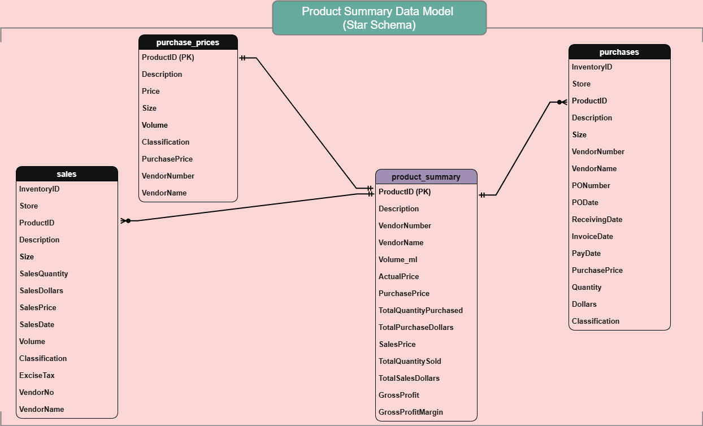
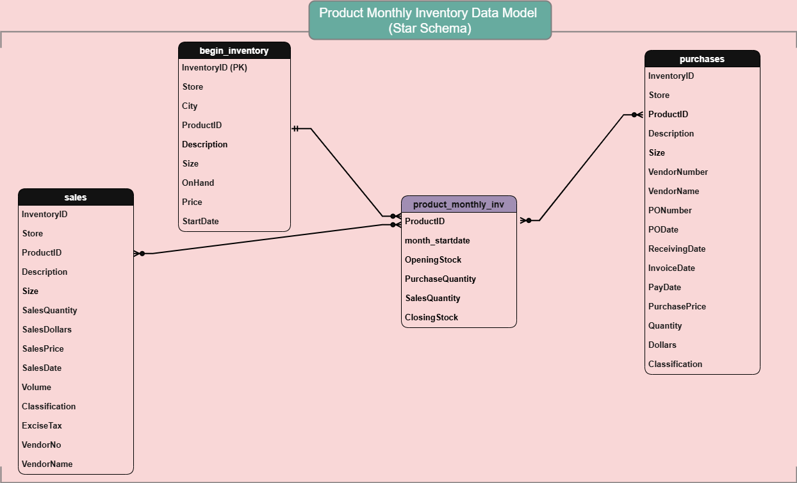
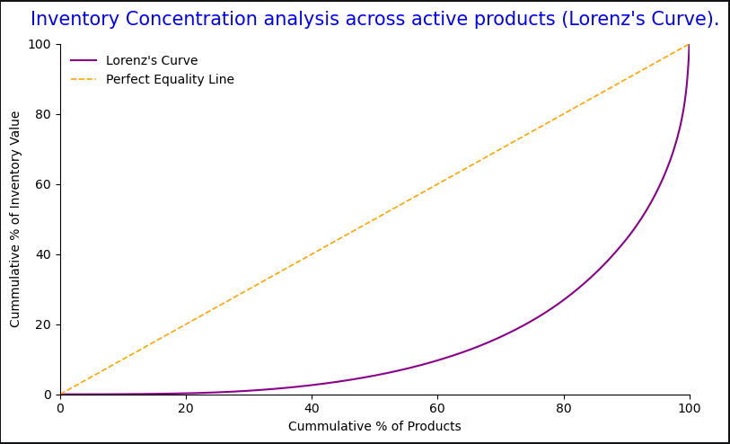
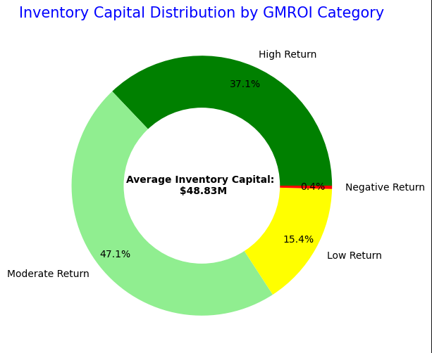
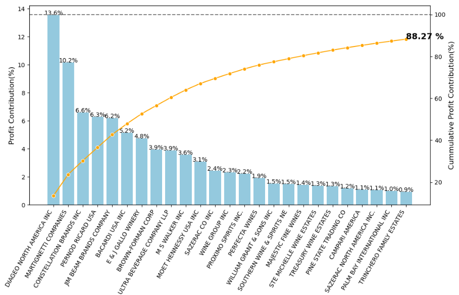
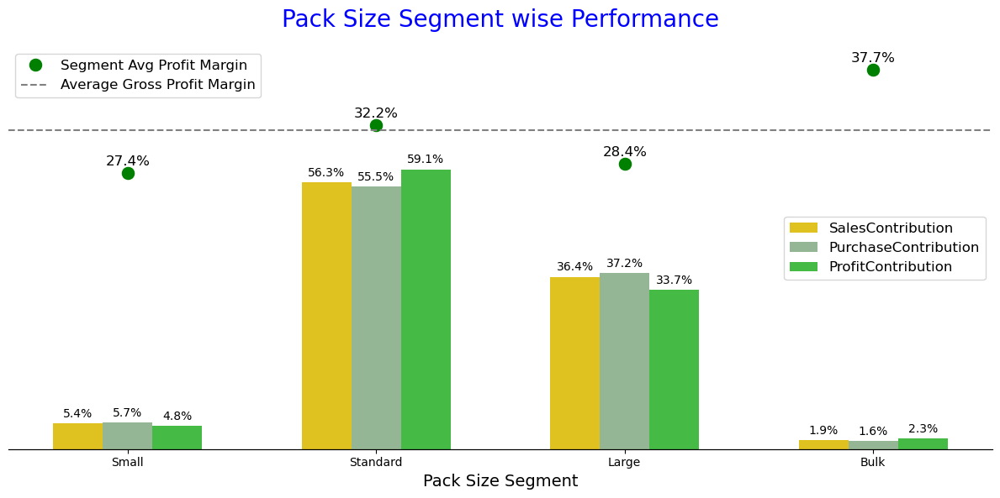
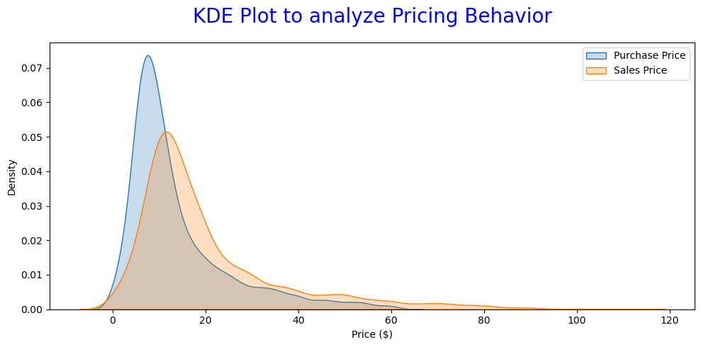
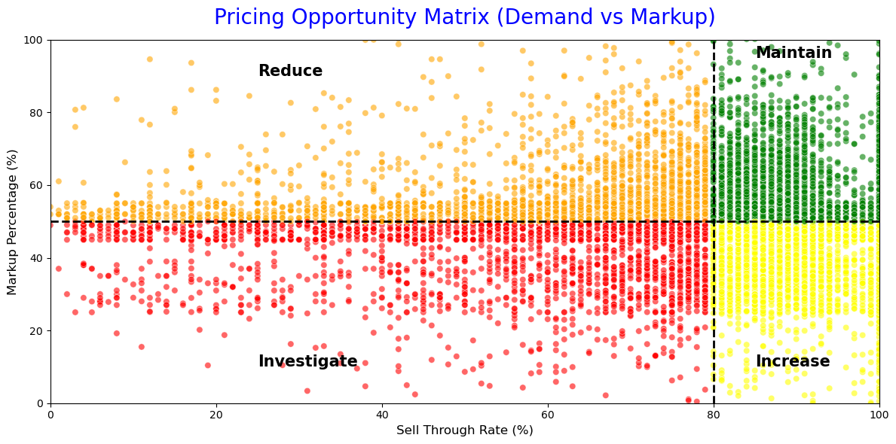
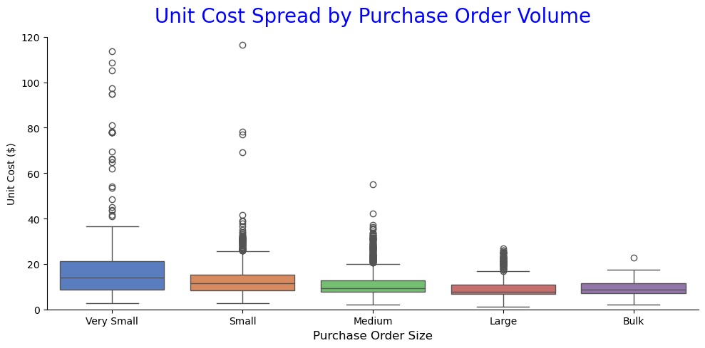

# 🛍️ Retail Inventory Analytics Project

## 📌 Overview
This project presents an end-to-end **retail inventory analytics solution** focused on optimizing inventory investment, improving turnover efficiency, and enhancing pricing and vendor strategies.  

The analysis is conducted on **2024 transactional and inventory data**, combining SQL-based data engineering with Python-driven analytics to generate **actionable business insights and recommendations**.

---

## 🎯 Business Objectives
The project is driven by the following key strategic goals:

- Portfolio Diversification to reduce SKU and Vendor Concentration Risk 
- Optimization of Inventory Investment Allocation across products  
- Improvement of Inventory Movement & Turnover Efficiency  
- Cost Optimization & Pricing Strategy Enhancement  
  
---

## 🧾 Dataset Description
**Time Period:** 2024   
The analysis is based on multiple retail datasets:

- Beginning Inventory (01 Jan 2024)  (200K+ records)
- Ending Inventory (31 Dec 2024)     (200K+ records)
- Sales Transactions           (12M+ records)
- Purchase Transactions        (2M+ records)
- Vendor Invoices              (5K+ records)
- Product Purchase Prices     (12K+ records)
 
---

## 🏗️ Data Preparation & Modeling  

### 🔹 Data Engineering (SQL)
- Designed and created relational database schema in MySQL  
- Developed transactional and master tables for structured storage  
- Performed data cleaning and transformation using SQL queries  
- Built aggregation queries to generate analysis-ready datasets  

### 🔹 ETL Pipeline (Python + SQLAlchemy)
- Implemented ETL pipelines using Python and SQLAlchemy for database interaction  
- Automated data extraction, transformation, and loading workflows  
- Incorporated validation checks to ensure data consistency and integrity  

---

## ⚙️ Data Pipeline Implementation  

### 🔸 Raw Data Ingestion  
- Created database and tables in MySQL for raw data storage  
- Loaded data using Python scripts integrated with SQLAlchemy  
- Utilized SQL operations (e.g., `LOAD DATA INFILE`) for efficient bulk ingestion  

### 🔸 Product Summary Dataset  
- Designed summary table in MySQL for product-level aggregation  
- Built ETL pipeline using Python and SQLAlchemy to transform and load aggregated data  

### 🔸 Monthly Inventory Snapshot  
- Created structured table for month-wise inventory tracking  
- Developed Python-based ETL pipeline to extract, transform, and load snapshot data  
- Ensured time-series consistency for inventory analysis 

---

## 📊 Analytical Data Models  

The following derived datasets were created for analysis:

### Product Summary Table  
- Aggregated KPIs at product level

### Product Monthly Inventory Snapshot  
- Monthly inventory metrics

---

## 📈 Analysis Performed  

### 1. Exploratory Data Analysis (EDA)
- Univariate analysis (distribution, skewness, outliers)  
- Bivariate analysis (relationships between variables)  
- Correlation analysis (feature dependencies)  

---

### 2. Inventory Health Analysis  

- Analysis of inventory efficiency trends using turnover, Days of Inventory (DOI), and inactive inventory percentage  
- Assessment of alignment between inventory investment and demand to evaluate how effectively stock supports revenue generation  
- Inventory concentration analysis to identify dependency on a limited set of products (Pareto / concentration insights)  
- Evaluation of inventory stability using coefficient of variation (CV) to measure consistency in stock levels  
- Analysis of inventory capital distribution across GMROI segments to assess the effectiveness of capital allocation  
- Inventory movement segmentation (fast, moderate, slow) to understand distribution across revenue contribution and capital lock-in  

---

### 3. Product Performance Analysis  
- Identification of top-performing products contributing significantly to revenue and overall business performance  
- Pack-size-wise performance analysis to uncover demand patterns and margin variability  
- Brand contribution analysis across revenue, procurement cost, and profit using sales-volume-based segmentation (Pareto insights)  
- Identification of high-potential brands for scaling based on margin strength and sell-through efficiency  
- Procurement and inventory investment optimization by aligning capital allocation with demand, profitability, and efficiency metrics  

---

### 4. Vendor Performance Analysis  
- Identification of high- and low-performing vendors based on revenue and profit contribution  
- Vendor concentration analysis to assess dependency on a limited set of suppliers (risk identification)  
- Evaluation of alignment between sales performance and profitability (hypothesis-driven analysis)  
- Identification of vendors with untapped potential for procurement expansion  
- Vendor segmentation into actionable priority groups using key operational metrics (revenue, gross margin, sell-through, and unsold inventory)   

---

### 5. Pricing Strategy Analysis  
- Price-band performance analysis to evaluate revenue and margin contribution across segments  
- Assessment of pricing behavior by comparing selling price and purchase cost to understand markup realization  
- Evaluation of markup consistency across pack sizes and price segments to identify pricing inefficiencies  
- Analysis of bulk procurement impact on unit cost to validate economies of scale  
- Identification of products with misaligned pricing (sell-through vs markup imbalance)  
- Benchmarking vendor-provided margins against price segment standards to identify negotiation opportunities    

---

## 🛠️ Tools & Technologies  

- **Database & Querying:** MySQL, SQL  
- **ETL & Processing:** Python, SQLAlchemy  
- **Analysis:** Pandas, NumPy, SciPy  
- **Visualization:** Matplotlib, Seaborn  
- **Development Environment:** VS Code, Jupyter Notebook  

---

## 📌 Key Insights  

- **High Concentration Risk:** Top 10 vendors drive 65% of revenue and top 20% of products contribute 85% of sales, indicating dependency on a narrow portfolio with an underutilized long tail  
- **Inefficient Capital Allocation:** Majority of budget is tied to mid/low-performing products, with only 37% allocated to high-return items and ~7% locked in obsolete inventory  
- **Inventory Inefficiencies:** Fluctuating turnover, rising variability, and 6–9% inactive stock highlight weak demand alignment and overstocking during slowdowns  
- **Skewed Product & Vendor Performance:** Small share of fast-moving products drives revenue, while slow-moving items and underperforming vendors occupy disproportionate inventory  
- **Pricing & Cost Gaps:** Margin inconsistencies across segments, tight price–cost spreads, and suboptimal pack mix indicate pricing and procurement inefficiencies  

---

## 💡 Business Recommendations  

- **Diversify & Optimize Portfolio:** Reduce dependency on top vendors/products by expanding high-potential vendors and scaling high-performing SKUs  
- **Reallocate Capital Efficiently:** Shift investment toward high-return products and eliminate obsolete/low-performing inventory  
- **Improve Inventory Planning:** Implement demand-driven replenishment using turnover, DOI, and sell-through metrics to stabilize inventory movement  
- **Rationalize Product & Vendor Base:** Focus on fast-moving products and high-performing vendors while reducing exposure to inefficient segments  
- **Leverage Pricing as a Growth Driver:** Optimize pricing, standardize markups, refine pack size strategy, and negotiate vendor costs to improve margins  

---

## 📄 Final Deliverable  

A comprehensive **Business Recommendation Report (PDF)** was created, summarizing:

- Key problems identified  
- Analytical insights  
- Strategic recommendations  

For a comprehensive breakdown of analysis, insights, and recommendations, refer to the full report:  
👉 [Recommendation Report](docs/recommendation_report.pdf)

---

## 🚀 How to Use This Project  

1. Run SQL scripts to create database and tables  
2. Execute Python ETL scripts to load and prepare data  
3. Open Jupyter notebooks for analysis and visualization  
4. Review final PDF for business insights  

---

## 📂 Project Structure

    ├── README.md          <- README for this project.
    ├── datasets              
    │   │
    │   └── begin_inventory.csv  <- inventory snapshot as of 1st Jan 2024
    │   └── end_inventory.csv    <- inventory snapshot as of 31st Dec 2024
    │   └── purchase_prices.csv  <- Product pricing table for procurement
    │   └── purchases.csv        <- all purchase transactions made in 2024
    │   └── sales.csv            <- all sales transactions made in 2024
    │   └── vendor_invoices.csv  <- purchase invoices
    │
    ├── scripts              <- DB creation and data ingestion (sql & python scripts).
    │   │
    │   ├── 01_raw_data_ingestion
    │   │   │
    │   │   └── 01_create_table.sql   <- sql script to create and define database,table
    │   │   └── 02_load.py            <- python script to load csv files into tables
    │   │
    │   ├── 02_product_summary
    │   │   │
    │   │   └── 01_create_table.sql   <- sql script to create and define table
    │   │   └── 02_etl.py             <- python script to extract,transform and load data
    │   │
    │   └── 03_product_monthly_inventory_snapshot
    │       │
    │       └── 01_create_table.sql   <- sql script to create and define table
    │       └── 02_etl.py             <- python script to extract,transform and load data
    │
    ├── logs     <- folder to record log files for python scripts 
    │   │
    │   ├── logs_raw_data_ingest.log      <- log file for raw data ingestion script
    │   ├── logs_product_summary_etl.log  <- log file for product summary etl script
    │   └── logs_product_monthly_inventory_etl.log  <- log file for product monthly inventory etl script
    │
    ├── notebooks     <- notebook files for analysis and visualizations 
    │   │
    │   ├── 01_exploratory_data_analysis.ipynb     <- EDA notebook file
    │   ├── 02_inventory_health_analysis.ipynb     <- Inventory Health Analysis notebook file
    │   ├── 03_vendor_performance_analysis.ipynb   <- Vendor Performance Analysis notebook file
    │   ├── 04_product_performance_analysis.ipynb  <- Product Performance Analysis notebook file
    │   └── 05_pricing_strategy_analysis.ipynb     <- Pricing Strategy Analysis notebook file
    │
    └── docs   <- Documentation
        │
        ├── data_dictionary.md     <- Table Structure and columns description 
        ├── data_model             <- Data model for derived tables
        ├── recommendation_report.pdf  <- Identified problems and recommendations 
        ├── metrics_definition.pdf     <- Retail Inventory key metrics definition
        └── sample_visuals             <- sample visuals generated during analysis

---

## 📷 Sample Visualizations

---